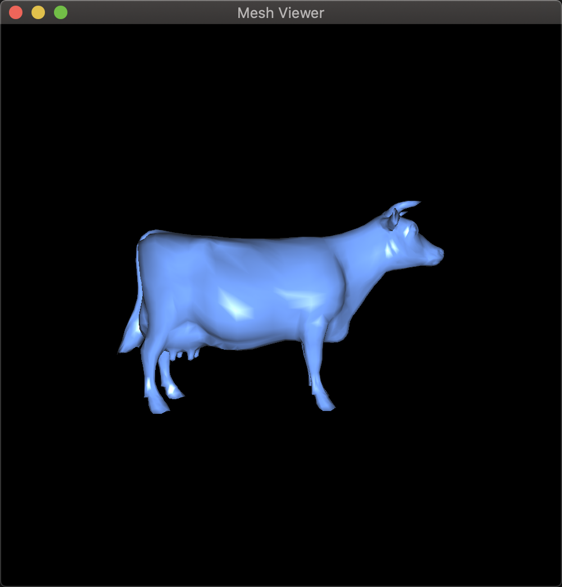
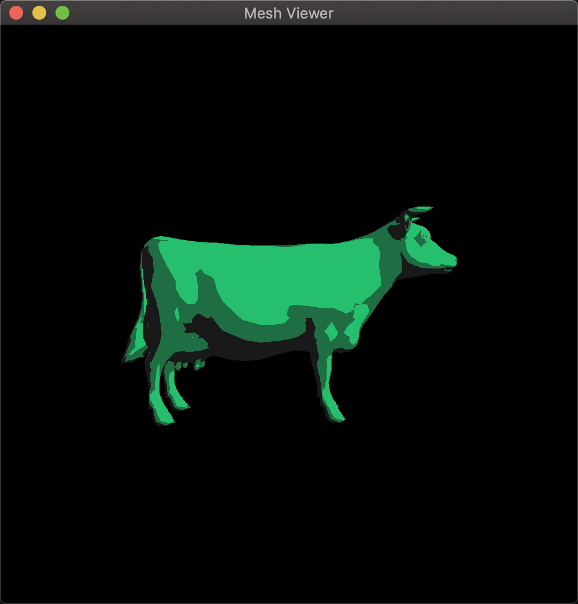
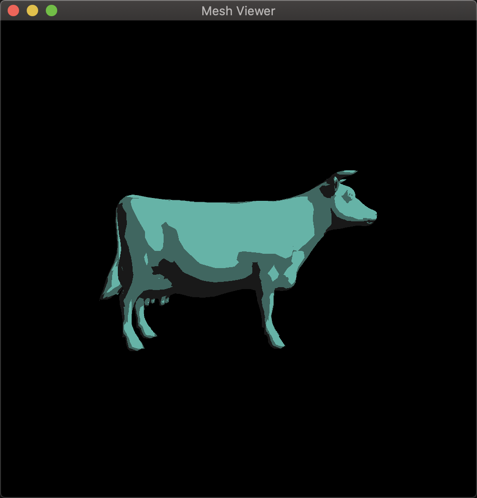
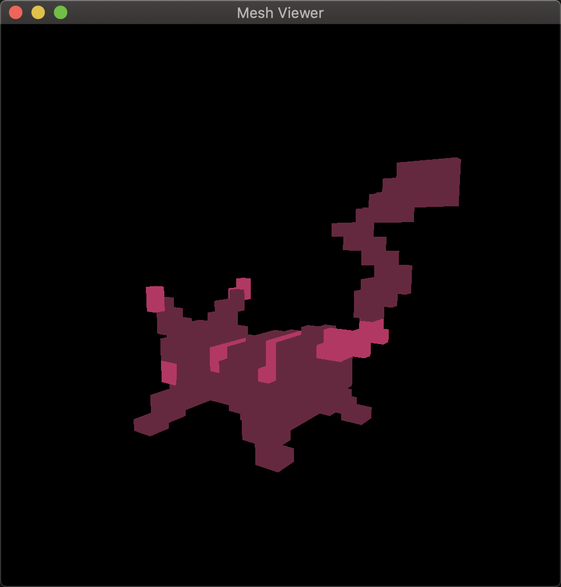
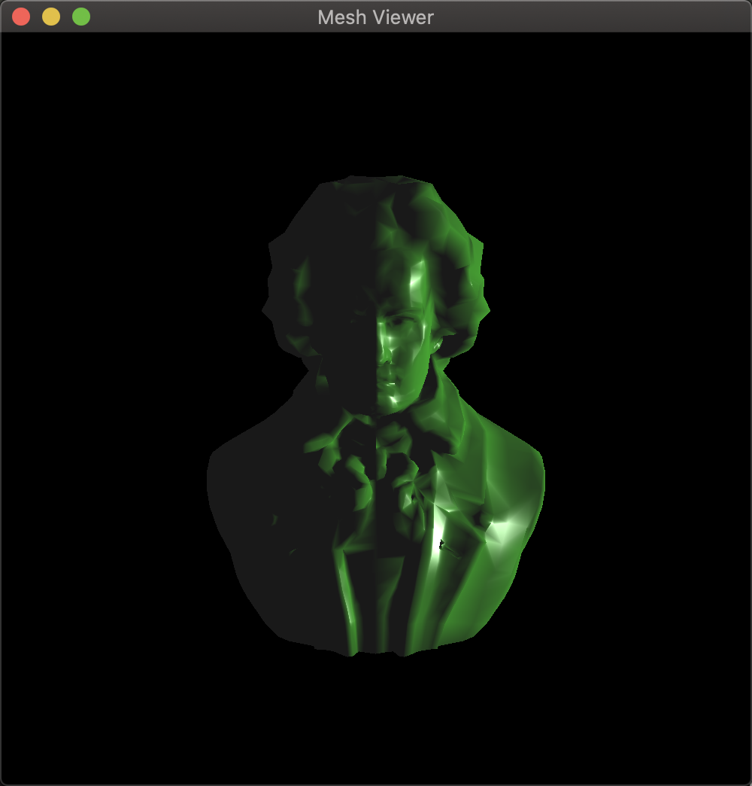
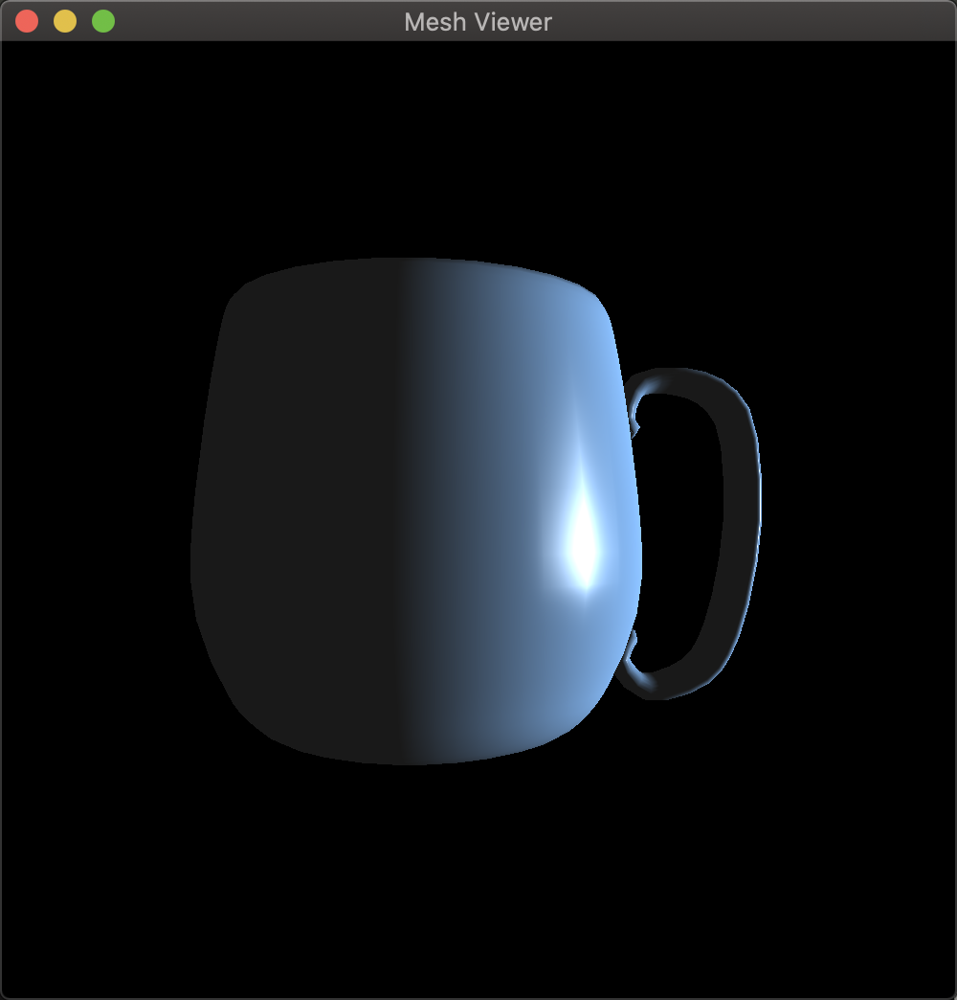
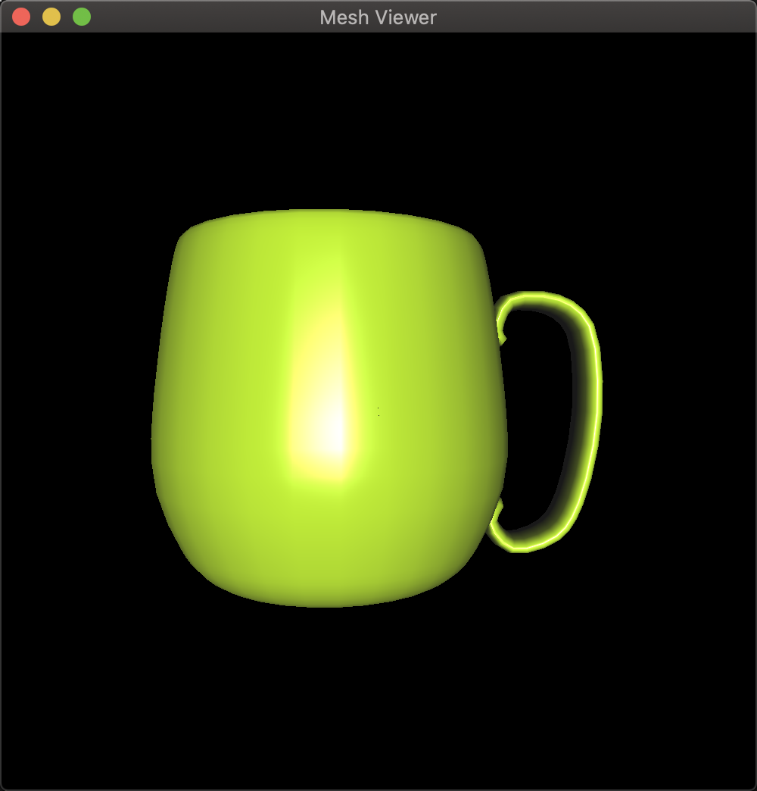
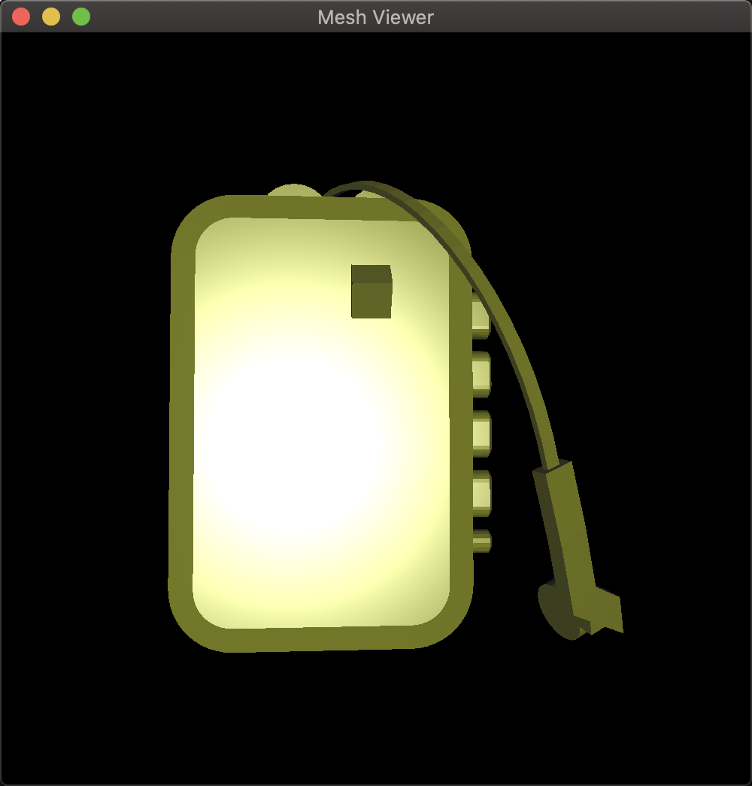
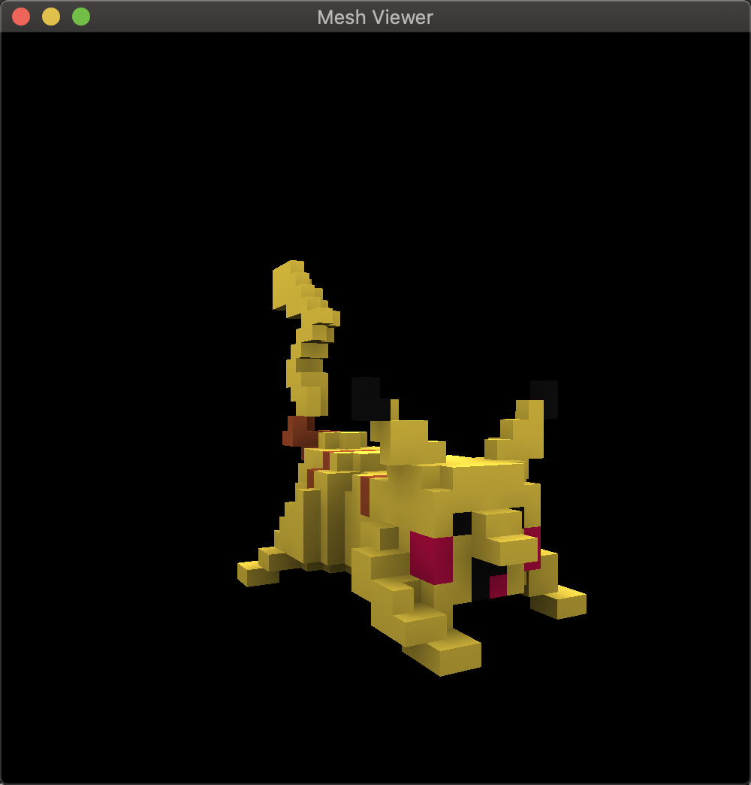
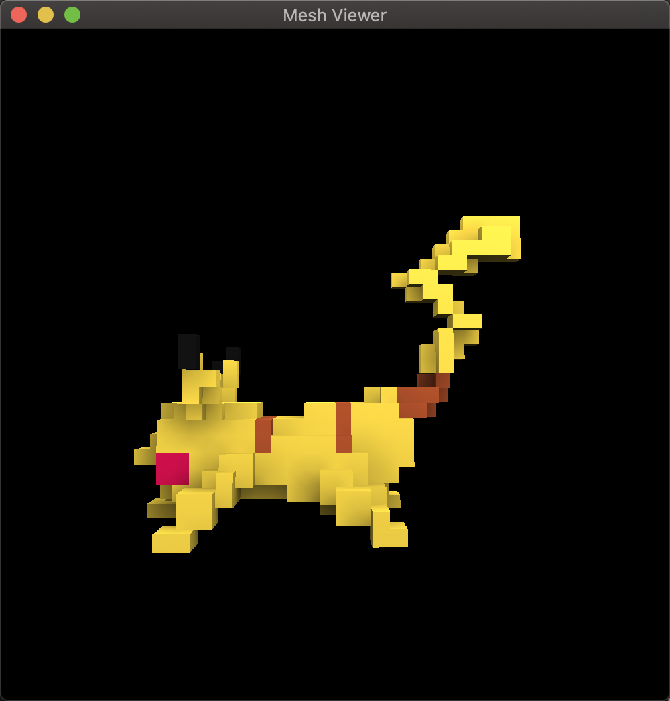

# mesh-viewer

OPenGL applications for viewing meshes

## How to build

*Windows*

Open git bash to the directory containing this repository.

```
mesh-viewer $ mkdir build
mesh-viewer $ cd build
mesh-viewer/build $ cmake -G "Visual Studio 16 2019" ..
mesh-viewer/build $ start CS312-MeshViewer.sln
```

Your solution file should contain multiple projects, such as `mesh-viewer`.
To run from the git bash command shell, 

```
mesh-viewer/build $ ../bin/Debug/mesh-viewer
```

*macOS*

Open terminal to the directory containing this repository.

```
mesh-viewer $ mkdir build
mesh-viewer $ cd build
mesh-viewer/build $ cmake ..
mesh-viewer/build $ make
```

To run each program from build, you would type

```
mesh-viewer/build $ ../bin/mesh-viewer
```

## Supported features

### Required features

*Camera Controls*: Left-drag orbits the camera around the model; SHIFT-left drag zooms in and out; n or N goes to the next model; p or P goes to the previous model.

*Phong-blinn Shading*: per-vertex ambient, diffuse, and specular (ADS) shading (shader: *phong*).

### Custom features

*Toon Shading*: creating a cartoon shading effect (shader: *toon*).

*Spotlight Effect*: simulating a spotlight with phong-blinn shading (shader: *spotlight*).

*Color Shading*: shade a model with colors specified in the .ply file (shader: color).

*Random Coloring*: randomly assigning a color to a model in every execution.

## Results

*Phong-blinn Shading*



*Toon Shading* and *Random Coloring*







*Spotlight Effect*









*Color Shading*






